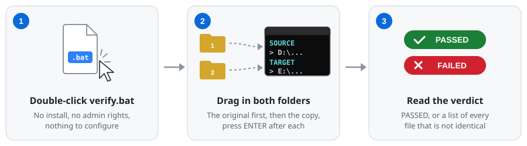
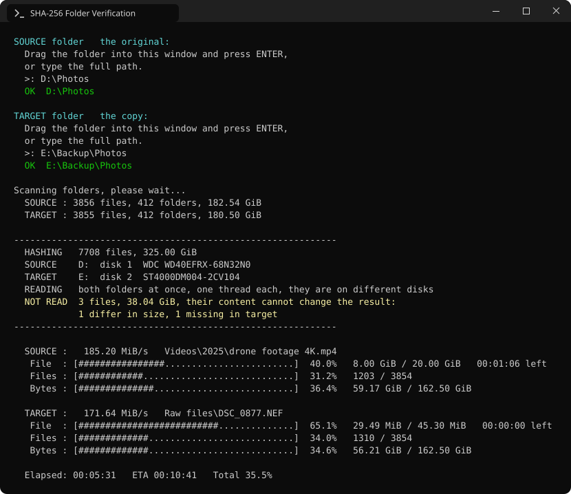
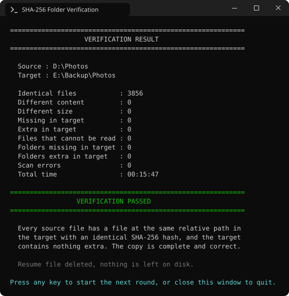
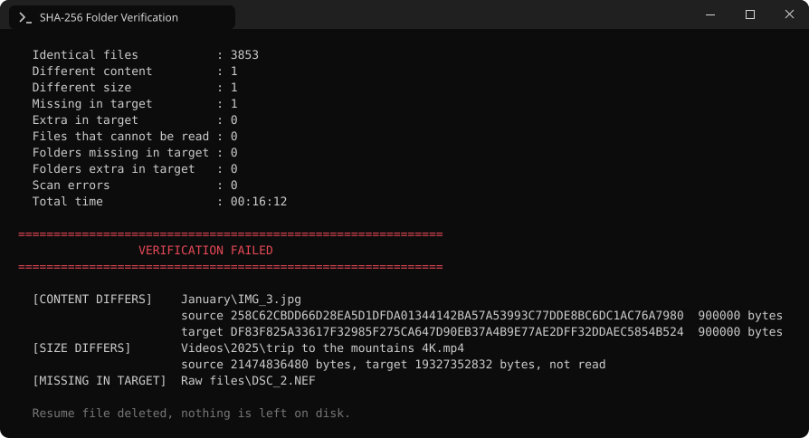
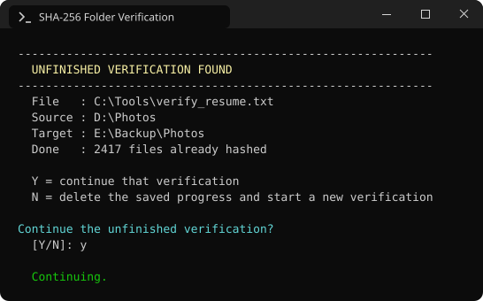
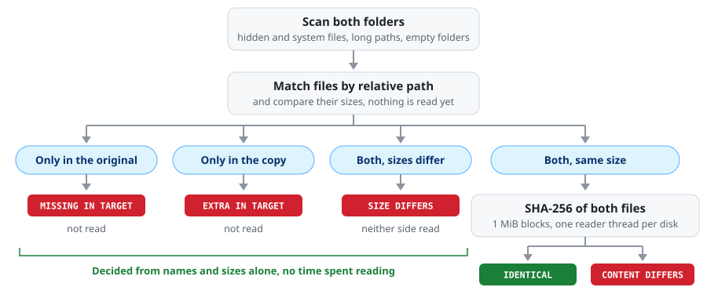
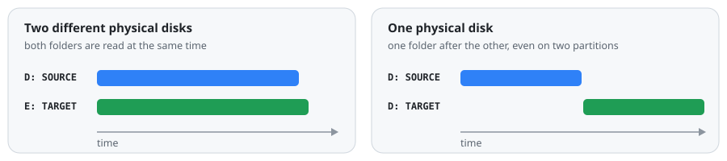

<div align="center">


# SHA-256 Folder Verify

**Copied a folder? Prove the copy is byte-for-byte identical.**

One double-clickable `.bat` file for Windows that reads every file on both sides,<br>
compares SHA-256 hashes and the whole folder tree, and gives you a clear verdict.

[](https://github.com/chchaoo/sha256-folder-verify/releases/latest)
[](#quick-start)
[](#quick-start)
[](LICENSE)

**English** · [简体中文](README.zh-CN.md)

### [⬇ Download verify.bat](https://github.com/chchaoo/sha256-folder-verify/releases/latest/download/verify.bat)

</div>

---

## Quick start

<p align="center"></p>

1. **[Download `verify.bat`](https://github.com/chchaoo/sha256-folder-verify/releases/latest/download/verify.bat)**. It is the whole program: nothing to install, no admin rights needed.
2. **Double-click it.** Drag the **original** folder into the window and press <kbd>Enter</kbd>, then drag the **copy** in and press <kbd>Enter</kbd>.
3. **Wait for the verdict.** `VERIFICATION PASSED` means every file is identical. Anything else lists every file that is not.

Press any key to check another pair of folders; close the window to quit.

**Requirements:** Windows 8 or later (it uses the built-in Windows PowerShell 3.0+) and read access to both folders.

> [!TIP]
> Windows may warn you the first time you run a downloaded `.bat`. See [Security warnings](#security-warnings) for why, and how to check the file first.

<p align="center"></p>

---

## Contents

- [Why](#why)
- [Features](#features)
- [What is checked](#what-is-checked)
- [Reading the result](#reading-the-result)
- [Stop any time, resume later](#stop-any-time-resume-later)
- [How it works](#how-it-works)
- [Leaves no trace](#leaves-no-trace)
- [Limitations](#limitations)
- [Security warnings](#security-warnings)
- [FAQ](#faq)
- [Version history](#version-history)

## Why

Windows regularly says a copy is *done* when it is not:

- a file was cut short;
- a file was silently skipped because of permissions, a long path or a lock;
- the target disk has bad sectors, and what was written is not what reads back;
- hidden files, system files or empty folders never made it across.

Explorer then shows two folders that *look* the same. File counts and total sizes can even match. The only way to know is to read both sides completely and compare them. That is what this tool does.

Typical uses: checking a backup on an external disk or NAS, making sure a migration is complete **before wiping the old disk**, and re-checking an old backup for silent corruption.

## Features

|  |  |
|---|---|
| 🔒 **Exact** | SHA-256 over every byte, plus a full comparison of the folder tree: paths, missing and extra files, empty folders. |
| 🙈 **Nothing slips through** | Hidden and system files, paths longer than 260 characters, names with `%` `!` `^` `&` `;` or any Unicode characters. |
| 📊 **Honest progress** | Per-file progress, even inside a single 50 GB file. Live speed for each side and a realistic time estimate. |
| ⚡ **No wasted reads** | Files that exist on one side only, or differ in size, are reported without being read. |
| 💽 **Disk aware** | One reader per disk. Two disks are read in parallel; one disk (even with two partitions) is read one folder at a time, which is what hard drives need. |
| ⏯️ **Resumable** | Close the window, reboot, come back tomorrow: an interrupted run continues where it stopped. |
| 🧹 **Leaves no trace** | Read-only on both folders. No install, no registry, no temp files. The progress file is deleted when the run finishes. |
| 📄 **One readable file** | The entire program is plain text inside `verify.bat`. Open it in Notepad and read it. |

## What is checked

| Checked | Not checked |
|---|---|
| The content of every file, byte for byte | Timestamps |
| Relative paths: each file must be at the same place | Permissions (ACLs) and attributes |
| Files missing in the copy | NTFS alternate data streams |
| Extra files in the copy | |
| Empty folders | |
| Hidden and system files | |

Two files with the same content but different modification times count as **identical**.
The two top-level folders may have different names: `D:\Photos` can be compared with `E:\Backup\Photos 2024`.

A file that cannot be read always **fails**. It is never counted as identical.

## Reading the result

<p align="center"></p>

When anything differs, every difference is listed below the counts:

<p align="center"></p>

| Tag | Meaning |
|---|---|
| `[CONTENT DIFFERS]` | Same size, different content. The two hashes are shown. |
| `[SIZE DIFFERS]` | Different size, so different content. Neither side was read. |
| `[MISSING IN TARGET]` | The file is in the original but not in the copy. |
| `[EXTRA IN TARGET]` | The file is in the copy but not in the original. |
| `[CANNOT READ]` | One side could not be read; the next line says which. |
| `[FOLDER MISSING IN TARGET]` / `[FOLDER EXTRA IN TARGET]` | A folder, possibly empty, is missing or extra. |
| `[SCAN ERROR …]` / `[READ ERROR …]` | A folder could not be listed or a file could not be read, with the reason. |

The verdict is `PASSED` only when every count except *Identical files* is zero.
Up to 500 lines of differences are shown. Nothing is written to disk, so scroll up for the rest.

## Stop any time, resume later

Every finished hash is appended to `verify_resume.txt` next to the `.bat`. If the window is closed, the PC crashes or the power goes out, just start it again:

<p align="center"></p>

Each saved hash carries the file's size and modification time. It is reused only when both are unchanged, so a file that was modified in between is read again. `N` discards the saved progress and starts over.

## How it works

<p align="center"></p>

**1. Scan.** Both trees are listed with the .NET file API on `\\?\` paths, which is what makes hidden files, system files and long paths work. Folder links and junctions are listed but not followed, so a junction pointing back up cannot loop forever.

**2. Match, then decide what to read.** Files are paired by relative path. Only same-size pairs can be identical or not, so only those are read. Everything else is settled by name and size alone. When a copy stopped half way, this skips the missing half entirely.

**3. Hash.** Files are read in 1 MiB blocks with `SHA256.TransformBlock`. The result is identical to `Get-FileHash`, and the display can follow progress inside each file. Files are opened read-only and shared, so a file that another program has open can usually still be read.

**4. Read each disk the way it likes to be read.**

<p align="center"></p>

A hard disk is fast only while it reads one file from start to end. Two readers on the same disk make the heads jump and throughput collapses. So each folder gets exactly one reader thread. Whether two folders share a disk is worked out through WMI, from drive letter down to the physical disk. SUBST drives and volumes that span several disks are handled, and two shares on the same server count as one disk. When in doubt, the folders are read one after the other.

**5. Estimate the time left.** Each file costs a fixed amount of time (finding it, opening it, seeking to it) plus time per MiB. The tool measures both as it goes (`seconds = A + K × size`, least-squares fit over recent files). The estimate therefore stays realistic when thousands of small files follow a few large ones.

<details>
<summary><b>Why one <code>.bat</code> file?</b></summary>

<br>

The first lines of `verify.bat` are a small CMD launcher. The actual program is PowerShell code stored after the `:::PS_BEGIN:::` marker in the same file. The launcher asks PowerShell to read the `.bat` itself, take the lines after the marker and compile them in memory. The command line stays about 200 characters long, and no temporary `.ps1` ever touches the disk.

Plain batch was tried first (see the [version history](CHANGELOG.md)). CMD cannot safely handle names containing `%` `!` `^` or a leading `;`, cannot see hidden files or empty folders, and fails on long paths.

</details>

## Leaves no trace

- Both folders are opened **read-only**. Nothing is ever written, moved or deleted in either of them.
- The only file the tool writes is `verify_resume.txt`, next to the `.bat` where you can see it. It is **deleted as soon as a run finishes**.
- No installer, no registry entries, no configuration file, nothing in `%TEMP%`.
- Results are shown on screen only.

## Limitations

- **The file cache.** Right after a copy, much of the copied data may still be in memory, and Windows serves reads from there. The comparison is still real, but it may not have touched the disk surface. For an important copy, **restart the PC before verifying**, or eject and reconnect an external disk.
- **The drive's own cache** (DRAM on HDDs and SSDs) cannot be bypassed by any user-mode program.
- **Links are not followed.** Folder links and junctions are listed in *Notes*, but their contents are not compared.
- **Case-insensitive**, like Windows. Two names that differ only by case on one NTFS volume are reported as a collision.
- **It reports, it does not repair.** Re-copy the files it lists.

## Security warnings

`verify.bat` starts PowerShell with `-ExecutionPolicy Bypass` (for its own process only) and compiles its engine at run time. Some malicious scripts do the same, so antivirus heuristics occasionally flag it. Files downloaded from the internet also carry a *Mark of the Web*, so Windows may show a warning before running it.

Nothing is hidden. The entire program is the plain text after `:::PS_BEGIN:::` in `verify.bat`. You can read all of it in Notepad before running it.

If Windows blocks the file, right-click `verify.bat` → **Properties** → tick **Unblock** → **OK**.

To make sure your download is the published file, compare its hash with the one in the [release notes](https://github.com/chchaoo/sha256-folder-verify/releases/latest):

```powershell
Get-FileHash .\verify.bat -Algorithm SHA256
```

## FAQ

<details>
<summary><b>Do the two folders need the same name?</b></summary>

No. Only the paths *inside* them are compared.
</details>

<details>
<summary><b>Does it work with USB drives, network shares and NAS?</b></summary>

Yes: local disks, USB drives, mapped network drives and `\\server\share` paths.
</details>

<details>
<summary><b>Why not just compare sizes and dates?</b></summary>

Truncated files are caught by size, but corrupted ones are not: a bad sector or a flipped bit leaves size and date untouched. Only reading the content finds those. Sizes are still compared first, so files that differ in size are reported without being read.
</details>

<details>
<summary><b>It was suspiciously fast right after the copy.</b></summary>

That is the file cache at work (see [Limitations](#limitations)). Restart and run it again to read from the disk itself.
</details>

<details>
<summary><b>Can I rename <code>verify.bat</code> or run it from inside one of the folders?</b></summary>

Yes to both. The progress file is always called `verify_resume.txt`. If the `.bat` sits inside one of the compared folders, that file is excluded from the comparison automatically.
</details>

## Version history

The tool grew over 14 versions, from a 130-line batch script to the current engine.
See **[CHANGELOG.md](CHANGELOG.md)**. Every earlier version is kept in [`history/`](history/).

## License

[MIT](LICENSE)
