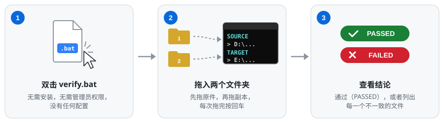
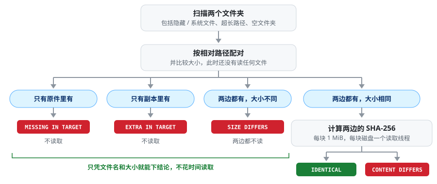
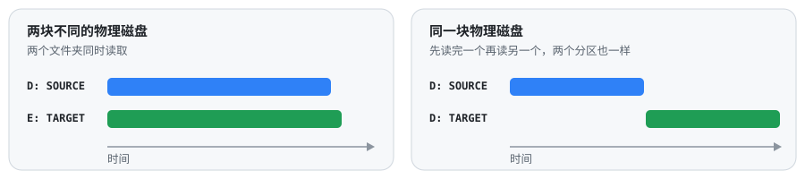

<div align="center">


# SHA-256 Folder Verify

**复制完一个文件夹？用它证明副本和原件逐字节完全一致。**

一个双击就能用的 Windows `.bat` 文件：把两边每个文件都完整读一遍，<br>
比对 SHA-256 和整棵目录树，给出明确的结论。

[](https://github.com/chchaoo/sha256-folder-verify/releases/latest)
[](#快速上手)
[](#快速上手)
[](LICENSE)

[English](README.md) · **简体中文**

### [⬇ 下载 verify.bat](https://github.com/chchaoo/sha256-folder-verify/releases/latest/download/verify.bat)

</div>

---

## 快速上手

<p align="center"></p>

1. **[下载 `verify.bat`](https://github.com/chchaoo/sha256-folder-verify/releases/latest/download/verify.bat)**。整个程序就这一个文件，不用安装，也不需要管理员权限。
2. **双击运行。** 把**原始文件夹**拖进窗口，按 <kbd>Enter</kbd>；再把**复制出来的文件夹**拖进去，按 <kbd>Enter</kbd>。
3. **等待结论。** 显示 `VERIFICATION PASSED` 就说明每个文件都完全一致；否则会列出每一个不一致的文件。

跑完按任意键可以接着比对下一组文件夹，关掉窗口就是退出。

**运行要求：** Windows 8 及以后的系统（使用系统自带的 Windows PowerShell 3.0 以上），对两个文件夹有读权限即可。

> [!TIP]
> 第一次运行下载来的 `.bat` 时，Windows 可能会弹出安全警告。原因和事先检查文件的方法见[安全提示](#安全提示)。

<p align="center"></p>

> 程序界面是英文的，各项含义见下文[结果怎么看](#结果怎么看)。

---

## 目录

- [为什么需要它](#为什么需要它)
- [功能特点](#功能特点)
- [检查范围](#检查范围)
- [结果怎么看](#结果怎么看)
- [随时中断与续跑](#随时中断与续跑)
- [工作原理](#工作原理)
- [不留痕迹](#不留痕迹)
- [已知局限](#已知局限)
- [安全提示](#安全提示)
- [常见问题](#常见问题)
- [版本历史](#版本历史)

## 为什么需要它

Windows 经常在复制并没有真正成功的时候照样显示"已完成"：

- 文件被截断了一半；
- 某个文件因为权限、路径太长或者被占用，被悄悄跳过；
- 目标盘上有坏扇区，写进去的数据读出来已经不一样了；
- 隐藏文件、系统文件、空文件夹没有被复制过去。

资源管理器给你看两个"看起来一样"的文件夹，文件数和总大小甚至可能都对得上。要确认副本真的完好，唯一的办法是把两边完整读一遍再比对，这个工具做的就是这件事。

典型用途：把照片、视频、资料备份到移动硬盘或 NAS 之后确认备份可用；换硬盘、迁移数据后，**在清空旧盘之前**做最后确认；定期检查旧备份有没有静默损坏。

## 功能特点

|  |  |
|---|---|
| 🔒 **结果可靠** | 对每一个字节算 SHA-256，并完整比对目录树：路径、缺少和多出的文件、空文件夹。 |
| 🙈 **不留盲区** | 隐藏文件、系统文件、超过 260 字符的长路径，文件名带 `%` `!` `^` `&` `;` 或任何中日韩字符都没问题。 |
| 📊 **进度精确** | 每个文件单独显示进度，读一个 50 GB 的大文件也能看到它在走；每一边都显示实时速度，剩余时间估得准。 |
| ⚡ **不做无用功** | 只在一边存在的文件、两边大小不同的文件，不用读就直接报告。 |
| 💽 **懂磁盘** | 每块磁盘一个读取线程：两块盘同时读；同一块盘（哪怕是两个分区）先读完一个文件夹再读另一个，这正是机械硬盘需要的读法。 |
| ⏯️ **可以续跑** | 关窗口、重启、明天再来都行，中断的校验会从停下的地方继续。 |
| 🧹 **不留痕迹** | 对两个文件夹只读；不安装、不写注册表、不留临时文件，进度文件跑完即删。 |
| 📄 **一个文件，完全可读** | 整个程序就是 `verify.bat` 里的纯文本，用记事本打开就能从头读一遍。 |

## 检查范围

| 检查 | 不检查 |
|---|---|
| 每个文件的内容，逐字节 | 时间戳 |
| 相对路径：同一个文件必须在两边的同一位置 | 权限（ACL）和文件属性 |
| 副本里缺少的文件 | NTFS 备用数据流 |
| 副本里多出来的文件 | |
| 空文件夹 | |
| 隐藏文件和系统文件 | |

内容相同但修改时间不同的两个文件，算**一致**。
两个顶层文件夹的名字可以不一样，比如 `D:\照片` 可以直接和 `E:\备份\照片2024` 比对。

读不了的文件一律判为**失败**，绝不会当成"一致"。

## 结果怎么看

<p align="center"></p>

有任何不一致时，会在计数表下面逐条列出：

<p align="center"></p>

计数表各项：

| 英文 | 含义 |
|---|---|
| Identical files | 完全一致的文件 |
| Different content | 两边都有、大小相同，但内容不同 |
| Different size | 两边都有，但大小不同（没有读取） |
| Missing in target | 副本里缺少的文件（没有读取） |
| Extra in target | 副本里多出来的文件（没有读取） |
| Files that cannot be read | 至少有一边读不了的文件 |
| Folders missing / extra in target | 副本里缺少 / 多出的文件夹 |
| Scan errors | 扫描目录时出错，通常是没有权限 |
| Total time | 本轮总耗时 |

差异标签：

| 标签 | 含义 |
|---|---|
| `[CONTENT DIFFERS]` | 大小相同但内容不同，下面两行是两边的哈希 |
| `[SIZE DIFFERS]` | 大小不同，内容必然不同；两边都没有读取 |
| `[MISSING IN TARGET]` | 原件里有，副本里没有 |
| `[EXTRA IN TARGET]` | 副本里有，原件里没有 |
| `[CANNOT READ]` | 有一边读不了，下一行说明是哪一边 |
| `[FOLDER MISSING IN TARGET]` / `[FOLDER EXTRA IN TARGET]` | 缺少 / 多出的文件夹（包括空文件夹） |
| `[SCAN ERROR …]` / `[READ ERROR …]` | 列不出某个文件夹或读不了某个文件，附带原因 |

除了 *Identical files* 以外每一项都是 0，结论才是 `PASSED`。
差异最多显示 500 行。结果不保存到磁盘，超出的部分请往上翻屏幕查看。

## 随时中断与续跑

每算完一个文件，它的哈希就会立即追加到 `.bat` 旁边的 `verify_resume.txt` 里。关了窗口、死机、断电都不要紧，再次运行即可：

<p align="center"></p>

每条哈希都带着当时的文件大小和修改时间，只有两者都没变才会复用，中间改动过的文件会重新读取。选 `N` 则丢弃进度，重新开始。

## 工作原理

<p align="center"></p>

**1. 扫描。** 用 .NET 文件接口配合 `\\?\` 设备路径遍历两棵目录树，隐藏文件、系统文件和超长路径能正常处理靠的就是这个。文件夹链接和 junction 会列出来，但不会进入遍历，避免指回上层的 junction 造成死循环。

**2. 配对，再决定读什么。** 按相对路径把两边的文件配对。只有两边都有、大小相同的文件，才需要读内容来判断，其余的只凭文件名和大小就能下结论。复制到一半中断的情况下，副本里缺的那一半根本不用读。

**3. 计算哈希。** 用 `SHA256.TransformBlock` 按 1 MiB 一块边读边算，结果和 `Get-FileHash` 完全相同，界面也因此能显示单个文件内部的进度。文件以只读、共享的方式打开，别的程序正开着的文件通常也能读。

**4. 按磁盘喜欢的方式读。**

<p align="center"></p>

机械硬盘只有在从头到尾连续读一个文件时才快，同一块盘上两个线程同时读，磁头来回跳，速度会断崖式下降。所以每个文件夹只用一个读取线程。两个文件夹是否在同一块盘上，是通过 WMI 从盘符一路追到物理磁盘判断的。SUBST 虚拟盘和跨多块盘的卷也能正确识别，同一台服务器上的两个共享也按同一块盘处理。判断不出来时，一律先后读。

**5. 估算剩余时间。** 读一个文件的耗时 = 固定开销（找到文件、打开、磁头移过去）+ 每 MiB 的读取时间。工具边读边测量这两项（`耗时 = A + K × 大小`，对最近的文件做最小二乘拟合），所以几个大文件之后跟着几千个小文件时，剩余时间依然估得准。

<details>
<summary><b>为什么只有一个 <code>.bat</code> 文件？</b></summary>

<br>

`verify.bat` 开头几十行是 CMD 写的启动器，真正的程序是同一个文件里 `:::PS_BEGIN:::` 标记之后的 PowerShell 代码。启动器让 PowerShell 读取这个 `.bat` 自身，取出标记后面的内容，在内存里编译执行。所以命令行始终只有两百来个字符，也不会有临时 `.ps1` 文件落到磁盘上。

最早的版本是纯批处理（见[版本历史](CHANGELOG.zh-CN.md)）。但 CMD 无法安全处理带 `%` `!` `^` 或以 `;` 开头的文件名，看不到隐藏文件和空文件夹，也处理不了超长路径。

</details>

## 不留痕迹

- 对两个文件夹都**只读**，不会往任何一边写入、移动或删除任何东西；
- 唯一会写的文件是 `.bat` 旁边的 `verify_resume.txt`，放在看得见的地方，**一轮校验跑完就立即删除**；
- 没有安装程序，不写注册表，没有配置文件，`%TEMP%` 里什么也不留；
- 结果只显示在屏幕上。

## 已知局限

- **系统文件缓存。** 刚复制完马上校验时，很多数据可能还在内存里，Windows 会直接从内存返回。比对本身是真的，但不一定读到了磁盘本身。重要的复制，建议**先重启电脑再校验**；移动硬盘可以先弹出再重新插上。
- **硬盘自带的缓存**（机械盘和固态盘板载的 DRAM）是任何用户态程序都绕不过去的。
- **链接不跟进。** 文件夹链接和 junction 会在 *Notes* 里列出，但里面的内容不参与比对。
- **不区分大小写**，和 Windows 一致。同一个 NTFS 卷上只差大小写的两个文件名会被报告为冲突。
- **只报告，不修复。** 请重新复制它列出的文件。

## 安全提示

`verify.bat` 以 `-ExecutionPolicy Bypass`（只对它自己的进程生效）启动 PowerShell，并在运行时编译自身携带的代码。一些恶意脚本也用同样的手法，所以杀毒软件的启发式扫描偶尔会拦截。从网上下载的文件还带有"来自 Internet"的标记，Windows 可能会在运行前弹出警告。

这里没有隐藏任何东西：整个程序就是 `verify.bat` 里 `:::PS_BEGIN:::` 之后的纯文本，运行之前可以先用记事本打开完整读一遍。

如果 Windows 阻止运行：右键 `verify.bat` → **属性** → 勾选**解除锁定** → **确定**。

想确认下载到的就是发布的那个文件，可以把它的哈希和 [Release 说明](https://github.com/chchaoo/sha256-folder-verify/releases/latest)里的对比一下：

```powershell
Get-FileHash .\verify.bat -Algorithm SHA256
```

## 常见问题

<details>
<summary><b>两个文件夹的名字必须一样吗？</b></summary>

不需要，只比较它们*内部*的相对路径。
</details>

<details>
<summary><b>支持 U 盘、网络共享和 NAS 吗？</b></summary>

支持：本地磁盘、U 盘、移动硬盘、映射的网络驱动器和 `\\服务器\共享` 路径都可以。
</details>

<details>
<summary><b>为什么不直接比较大小和修改时间？</b></summary>

被截断的文件大小会变，比大小能发现；但坏扇区或者某一位翻转了，大小和时间都不会变，只有读内容才能发现。大小仍然会先比较：大小不同的文件不用读就直接报告。
</details>

<details>
<summary><b>刚复制完校验，速度快得不正常？</b></summary>

这是系统文件缓存在起作用（见[已知局限](#已知局限)）。重启后再校验一次，就是从磁盘本身读了。
</details>

<details>
<summary><b>可以给 <code>verify.bat</code> 改名，或者放在被校验的文件夹里运行吗？</b></summary>

都可以。进度文件的名字固定是 `verify_resume.txt`；如果 `.bat` 放在被比对的文件夹里面，这个进度文件会被自动排除在比对之外。
</details>

## 版本历史

这个工具经历了 14 个版本，从一个 130 行的批处理脚本演变成现在的样子。
详见 **[CHANGELOG.zh-CN.md](CHANGELOG.zh-CN.md)**，以前的每个版本都保存在 [`history/`](history/) 目录里。

## 许可证

[MIT](LICENSE)
